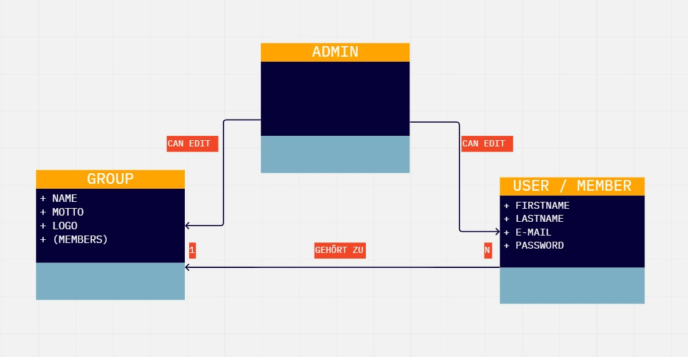

# Prerequisites
This project requires you to use the Java JDK Version 18. \
Please select the appropriate JDK in the IntelliJ project settings.

You'll need a Docker container running **PostgreSQL** on port 5432. 
If you have not already, you can set up such a docker container using the command:

`docker run --name postgres-db -e POSTGRES_USER=postgres -e POSTGRES_PASSWORD=postgres -p 5432:5432 -d postgres`

The username and password are assumed to be both "postgres". 
You can change the username and password that hibernate uses in application.properties.

# Setup
Open the applicaiton in IntelliJ. you should be able to execute the application after IntelliJ has finished indexing all the files and building the gradle project.
Build & Run the application (e.g. by runnung the bootRun Gradle task).

the application should start and run now. You should see a message similar to this at the end of a long console log:\
`2021-09-14 14:31:15.056  INFO 27988 --- [           main] com.example.demo.DemoApplication         : Started DemoApplication in 4.122 seconds (JVM running for 4.991)`

If you've set up the project correctly you should be able to access the endpoint `http://localhost:8080/` after logging in with the following user:

# Common Issues & Fixes
* Restart the PostGreSQL container & check the container is running
*	Confirm connection to the DB (e.g. in DBeaver)
*	Restart IntelliJ & your Spring Boot application

# Hints

* You can add mock data to your database on startup using an SQL script named `data.sql` placed in the resources folder
* You can execute statements at startup by adding them to `AppStartupRunner.run()`

# ERD Diagram
 

# Domain Model

