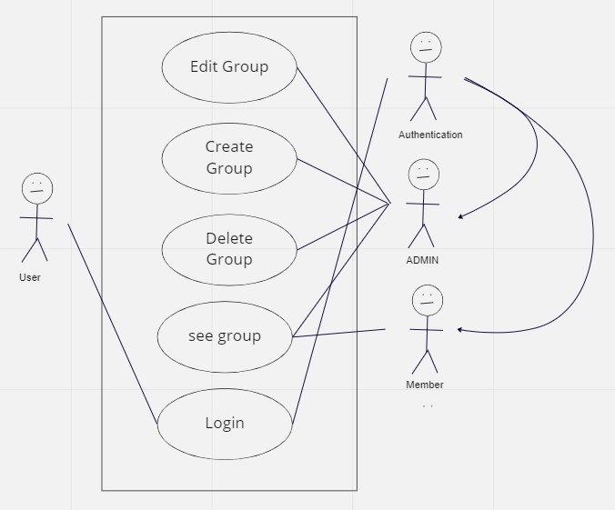

# Table of contents
1. [Prerequisites](#Prerequisites)
2. [Setup](#Setup)
    1. [Frontend](#Frontend)
    2. [Backend](#Backend)
    3. [Users](#Users)
3. [Common Issues & Fixes](#Common-Issues-&-Fixes)
4. [Hints](#Hints)
5. [Testing](#Testing)
    1. [cypress Setup](#cypress-Setup)
    2. [Postman Setup](#Postman-Setup)
    3. [Cypress Tests](#Cypress-Tests)
    4. [Postman Tests](#Postman-Tests)
6. [Domain Model](#Domain-Model)
7. [Use Case Diagram](#Use-Case-Diagram)
8. [Use Case Description](#Use-Case-Description)
9. [Sequence Diagram](#Sequence-Diagram)
10. [ERD Diagram](#ERD-Diagram)

# Prerequisites

This project requires you to use the Java JDK Version 18. \
Please select the appropriate JDK in the IntelliJ project settings.

You'll need a Docker container running **PostgreSQL** on port 5432.
If you have not already, you can set up such a docker container using the command:

`docker run --name postgres-db -e POSTGRES_USER=postgres -e POSTGRES_PASSWORD=postgres -p 5432:5432 -d postgres`

The username and password are assumed to be both "postgres".
You can change the username and password that hibernate uses in application.properties.

# Setup

## Frontend
Open the frontend folder in Visual Studio Code. Open a Command Prompt Terminal and enter the command `yarn install` and after that `yarn start`. 

## Backend
Open the backend folder in IntelliJ. you should be able to execute the application after IntelliJ has finished indexing all the files and building the gradle project.
Build & Run the application (e.g. by running the bootRun Gradle task).

the application should start and run now. You should see a message similar to this at the end of a long console log:\
`2021-09-14 14:31:15.056 INFO 27988 --- [ main] com.example.demo.DemoApplication : Started DemoApplication in 4.122 seconds (JVM running for 4.991)`

## Users
If you've set up the project correctly you should be able to access the endpoint `http://localhost:3000/` after logging in with the following user: \
email: **admin@example.com** (admin) \
password: **1234** \
email: **user@example.com** (normal user) \
password: **1234**

# Common Issues & Fixes 

- Restart the PostGreSQL container & check the container is running
- Confirm connection to the DB (e.g. in DBeaver)
- Restart IntelliJ & your Spring Boot application

# Hints

- You can add mock data to your database on startup using an SQL script named `data.sql` placed in the resources folder
- You can execute statements at startup by adding them to `AppStartupRunner.run()`

# Testing

We tested our application with **Cypress & Postman**.  
We chose **postman** for testing because it is simple, quickly done & effective. \
The reason we chose **cypress** is because it is a very good & intuitive tool for testing the frontend. It was also new for Manuel, so he could learn something new. \
We decided to not use JUnit because it's harder to implement and use than Cypress & Postman. \
To run the tests, you need to have the application running on localhost:3000. 
## cypress Setup
Then you can run the Cypress tests with the command `npx cypress open` in the frontend terminal. \
## Postman Setup
For the Postman tests, you can import the collection from the Postman folder **(backend/src/test/postman)** and run the tests. 

## Cypress Tests
Our Cypress tests cover the following use cases: 
* Only Admin can go to the the admin page (/admin) 
* Only Admin can create, edit & delete a group 
* normal user can only see the group details, where the user is part of and admin has access to all group details 

## Postman Tests
Our Postman tests cover all our endpoints on authorization and response. 

# Domain Model
This is the domain model of our application.\

# Use Case Diagram
This is our Use Case Diagram.\

# Use Case Description
This is a Use Case Description for creating a group as an admin. \

# Sequence Diagram
This is a sequence diagram of the Administrating_group test in Cypress. \

# ERD Diagram 
This is the ERD Diagram of our application. \

